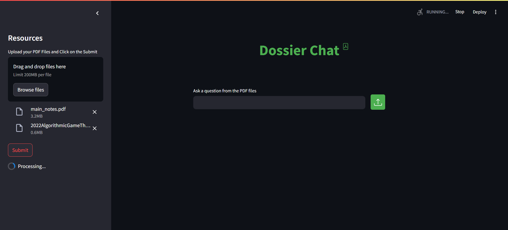
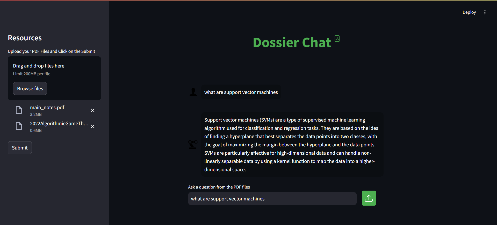

# Dossier Chat 


## Overview

The **Dossier Chat** app allows users to upload PDF files and interact with the content through a conversational AI interface. The app extracts the text from uploaded PDFs, indexes it, and enables the user to ask questions about the PDF content. The AI model uses advanced embeddings and a question-answering system to provide detailed answers to user queries.

## Features

- Upload and process multiple PDF files.
- The app extracts text from the PDFs and splits it into manageable chunks for efficient querying.
- Seamless conversational interface where users can ask questions related to the content of the uploaded PDFs.
- Google Generative AI model is used for text embedding and answering user queries.
- Interactive UI with user and bot messages styled in a chat format.
- Stores and processes previous user questions and answers.

## Requirements

To run the app, you need:

- Python 3.x
- Google API Key (for Google Generative AI)
- Conda (for managing environments)
- Required Python packages:
  - `streamlit`
  - `PyPDF2`
  - `langchain`
  - `langchain-google-genai`
  - `google-generativeai`
  - `faiss`
  - `python-dotenv`
  - `io`
  - `time`

You can install the required dependencies using:

```bash
pip install -r requirements.txt
```

## Setup

1. Clone the repository :
```bash
git clone https://github.com/yourusername/pdf-chat-app.git
cd pdf-chat-app
```

2. Create and activate a Conda environment :

- Create a Conda environment with Python 3.8 (or another version if necessary):

```bash
conda create -p venv python=3.10
```

- Activate the environment:
```bash
conda activate venv/
```

3. Environment Setup:

- Create a `.env` file in the root directory.
- Add your Google API key to the .env file:
```bash
GOOGLE_API_KEY=your_google_api_key
```

4. Running the App: 

- Launching the app with:
```bash
streamlit run app.py
```

The app should be accessible on http://localhost:8501 in your browser.

## Project Structure

```bash
dossier-chat/
│
├── app.py              # Main application file
├── .env                # Environment variables (Google API key)
├── requirements.txt    # Python dependencies
│── /assets             # Example images and svg 
└── README.md           # Project documentation
```

## How It Works

1. Upload PDFs:

    - The user can upload one or more PDF files from the sidebar.
    - The app processes these files and extracts text from them.

2. Text Processing:

    - The text is split into smaller chunks using `RecursiveCharacterTextSplitter` for efficient searching.
    - These text chunks are indexed and saved using `FAISS`, which enables fast similarity search.

3. Ask Questions:

    - The user can type a question in the chat input.
    - The app performs a similarity search on the indexed text and retrieves the most relevant text chunks.
    - The question is passed to the Google Generative AI model, which generates a detailed response based on the context from the PDF content.
4. Previous Questions and Answers:

    - The app stores the last question and response, displaying them in the chat interface for the user to refer to.

## Example Usage
1. Uploading PDF Files

- To begin, upload your PDF files through the sidebar. The app will process the files and prepare them for semantic search.

<br>


<br>
<br>


- Once uploaded, the app will extract text from the PDFs and break it into manageable chunks for search.
<br><br>

2. Asking Questions
- After the files are processed, you can ask questions related to the PDF content. The app will use the stored embeddings to find the most relevant information and respond.

- Example: Q&A Interaction
<br>
<br>


<br>


## UI and Interaction

- Chat Interface:

    - The chat interface displays messages from both the user (with a human icon) and the bot (with a robot icon) in a visually appealing style.
    - The user inputs questions, and the bot responds with answers based on the content of the uploaded PDFs.
- Sidebar:

    - The sidebar allows users to upload PDF files and trigger the processing with the "Submit" button.

## Customization

You can customize the following:

- **Text Splitter Configuration**: Change the `chunk_size` and `chunk_overlap` parameters in the `RecursiveCharacterTextSplitter` class to control how the text is divided into chunks.

- **Google Generative AI Model**: You can update the model used for embedding and answering questions by modifying the  `model="models/embedding-001"` and `model="gemini-pro"` in the code.

## Troubleshooting
- **Rate Limiting Error (429)**: If you encounter a rate limit error from the Google API, the app will notify you to try again later. You can adjust the timeout and retry logic as necessary.
- **No Text Extracted from PDFs**: Ensure that the PDFs are text-based and not scanned images. Scanned PDFs may require OCR processing.


## License

This project is licensed under the MIT License.


